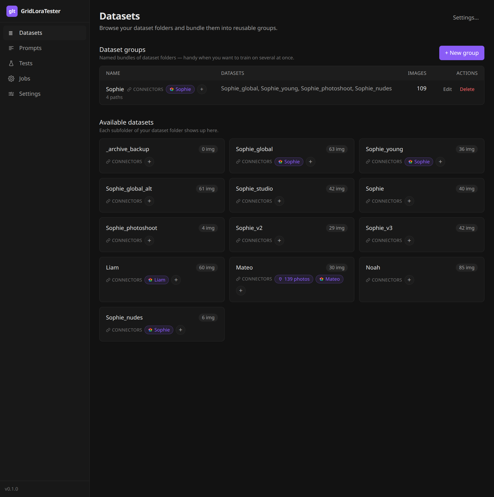
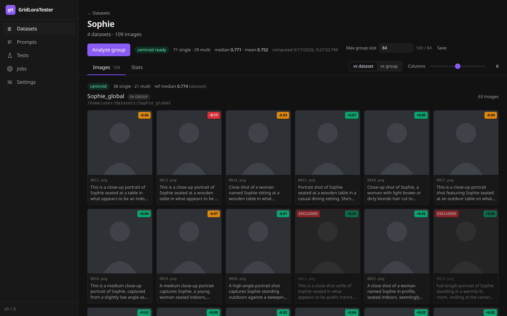
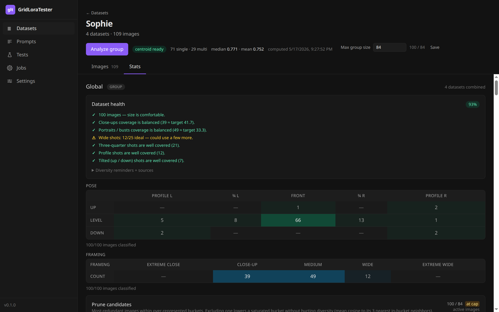
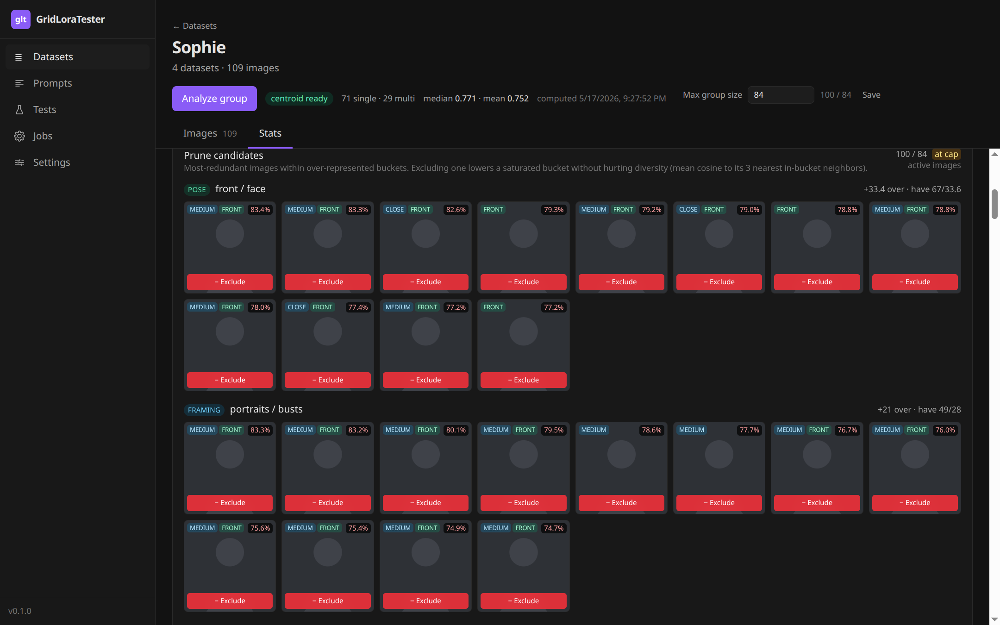
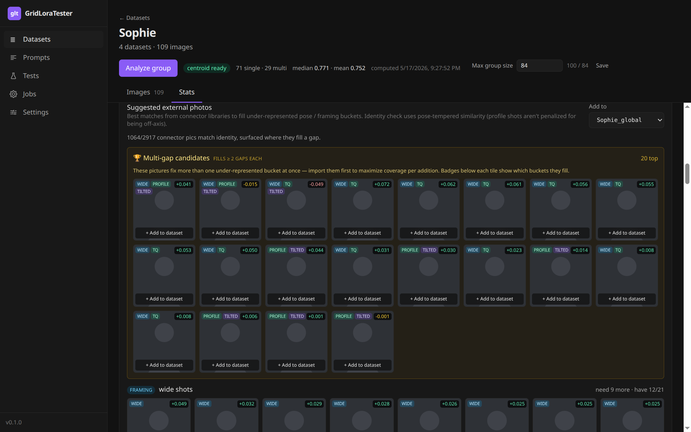
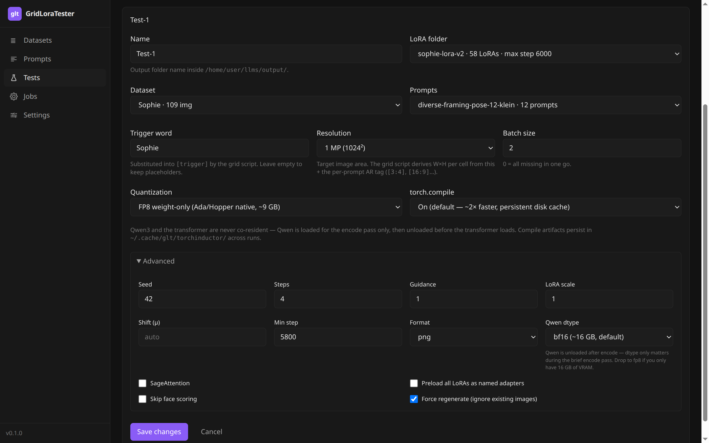
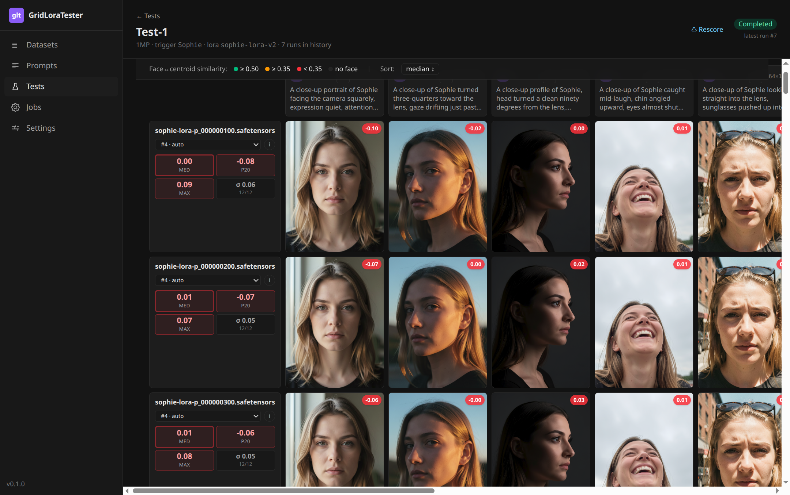
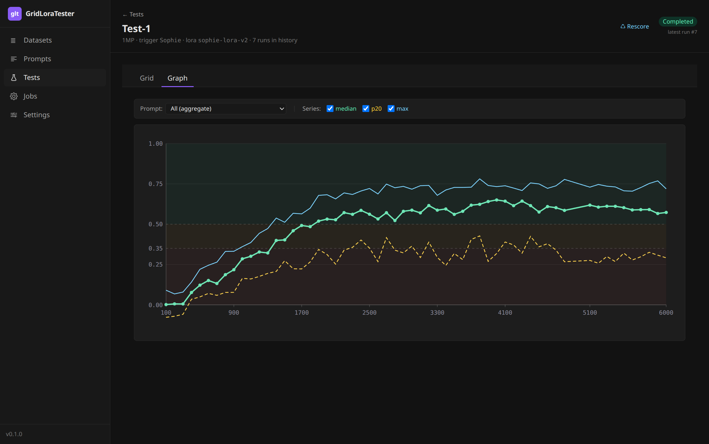

# GridLoraTester

A workbench for **character LoRA training** on FLUX.2: dataset curation
+ post-training evaluation, both driven by face-recognition scores. The
Python side (`glt/`) runs inference and ArcFace identity scoring on a
local GPU; the SvelteKit dashboard (`ui/`) sits on top with browsing,
diversity analysis, and grid-test orchestration.

<p align="center">
  <a href="docs/screenshots/datasets.png">
    
  </a>
</p>

What's in the box:

- **InsightFace** `buffalo_l` for detection + ArcFace embedding (512-d).
  Every dataset photo and every generated image is reduced to a cosine
  similarity against a per-dataset **centroid** (mean of all detected
  faces). Numbers, not eyeballing.
- **Pose / framing classifiers** that bucket each photo (front /
  ¾ / profile × close-up / medium / wide), so you can see what's
  over- or under-represented before training, not after.
- **BlockHash 256-bit** perceptual hash with a 10-bit Hamming threshold
  to dedup near-identical shots inside the dataset AND inside the
  suggestions from external sources.
- **Diffusers + FLUX.2-Klein** for generation, with FP8 weight-only /
  FP8 dynamic / INT8 + Hadamard ConvRot / bf16 paths. INT8 ConvRot is
  ~2× faster than FP8 on Ampere thanks to `torch._int_mm`.
- **`torch.compile` + INT8 LoRA bake-in** so per-row LoRA swaps don't
  trigger recompilation (~1.8 s swap, no warmup tax).

The two surfaces below are independent — use one without the other if
you only need half.

---

## Dataset curation

Goal: end up with a dataset that's identity-consistent, deduped, and
balanced across pose + framing buckets, without manually sorting
thousands of photos.

### Browsing

<a href="docs/screenshots/datasets.png">
  
</a>

`/datasets` lists every subfolder of your configured dataset root plus
the named **groups** (logical bundles, stored in `dataset_groups`).
Each card shows the per-folder image count and the connector pills
currently linked to it. Groups can pull from multiple folders so one
training run can combine sources without copying files around.

### Per-dataset face-score grid

<a href="docs/screenshots/dataset-group.png">
  
</a>

Opening a dataset (or group) renders every image as a thumbnail with:

- The **centroid delta** badge in the top-right (signed similarity
  delta vs the dataset's own centroid — green ≥ +0.05, amber 0 to
  +0.05, red < 0).
- Soft-delete via the `EXCLUDED` flag — the file stays on disk, the
  row in `dataset_images` flips `status` to `'excluded'`, and the
  centroid recomputes against the active set.
- A lightbox with arrow-key navigation that also exposes the
  AI-generated caption stored on each image.

For group scope, an extra toggle switches the scoring reference from
"each member's own centroid" to "the global group centroid", useful
when you're comparing how consistent the photo identity is across
folders.

### Coverage + health

<a href="docs/screenshots/dataset-stats.png">
  
</a>

The **Stats** tab classifies every face into a pose × framing bucket:

- **Pose**: PROFILE L · ¾ L · FRONT · ¾ R · PROFILE R, each crossed
  with UP / LEVEL / DOWN (yaw via InsightFace landmarks, with a small
  per-dataset calibration offset for systematic tilts).
- **Framing**: extreme-close / close-up / medium / wide / extreme-wide
  (face-area ratio, calibrated against published portrait-photography
  framing definitions).

The **Dataset health** card derives target counts from a configurable
total-size budget and tags each bucket as balanced (✓), under-rep (⚠),
or over-rep. Targets come from a small published heuristic for
character-LoRA dataset composition — they're not magic numbers, see
`lib/dataset-targets.ts`.

### Prune candidates

<a href="docs/screenshots/dataset-stats-prune.png">
  
</a>

For each over-represented bucket, the prune engine surfaces the
**most-redundant photos within that bucket** — ranked by mean cosine
similarity to their k=3 nearest in-bucket neighbours (`prune-
suggestions.ts`). Picking the most redundant drops a near-twin first
rather than collapsing the bucket's diversity. Excluding is a soft
delete; the lightbox shows the candidate next to its closest peers so
you keep the best of each cluster, not just the first one you click.

### Connector suggestions

<a href="docs/screenshots/dataset-stats-suggestions.png">
  
</a>

Once a connector is linked, the suggestion engine
(`connector-suggestions.ts`) mines its library for photos that:

1. Match the dataset's identity (cosine ≥ `SUGGESTION_DELTA_MIN`
   against the centroid, pose-tempered so a profile shot isn't
   penalised for being off-axis).
2. Aren't already imported (UNIQUE constraint on
   `(connector_id, picture_id)` in `dataset_images`).
3. Pass a perceptual-hash dedup against active dataset images AND
   against each other (BlockHash 256-bit, Hamming threshold 10).
4. Land in a currently under-represented bucket.

The top section flags **multi-gap candidates** (photos that fill ≥ 2
buckets at once, ranked by total gap_score). Per-bucket sections drill
into single-gap fills. "+ Add to dataset" downloads the original
bytes via the connector's `downloadPicture()` and inserts a
`dataset_images` row with `source_kind='imported'`.

### Photo-library connectors

- **Immich** — link a person from your Immich library (Settings →
  Connectors → add API key + base URL). Face-detected pictures stream
  in via a background job, scored against the dataset centroid.
- **Google Photos** — picker-API integration. Clicking "Add Google
  Photos" creates a session, opens Google's picker in a new tab,
  polls until the user finishes selecting, then downloads bytes into
  `~/.cache/glt/google-photos/<scope-hash>/` (Google's `baseUrl` is
  valid 60 min). After the cache fills, the same face-detect pipeline
  used for hard-drive connectors takes over.
- **Folder on disk** — point at any local directory. No
  configuration; the link itself carries the path.

---

## LoRA testing

Goal: once you have a folder of `.safetensors` checkpoints and a prompt
set, generate every (LoRA × prompt) cell, score each one against the
dataset centroid, and decide which step holds likeness across the
sweep — not just on the prompt that flatters it.

### Test definitions

<a href="docs/screenshots/tests.png">
  
</a>

A test is a row in the `tests` table that points to:

- A **LoRA folder** (one family / training run; the dashboard lists
  every `.safetensors` it finds, with the parsed training step).
- A **dataset** (single folder OR a group — the centroid for scoring
  comes from here).
- A **prompt set** (named list, stored in `prompt_sets`; prefix
  prompts with `[3:4]`, `[16:9]`, … to drive per-prompt aspect ratio,
  and use `[trigger]` for the LoRA's trigger word — substituted
  before encoding).
- Generation knobs: target megapixels (`1MP`, `2MP`, …), batch size,
  quant mode (`fp8_weight` / `fp8_dynamic` / `int8_convrot` /
  `bf16` / `auto`), `torch.compile` mode (`on` / `auto` / `off`),
  seed, steps, guidance, LoRA scale, optional shift, **min step**
  filter (skip checkpoints below this training step), SageAttention,
  preload-all-LoRAs as named adapters, Qwen3 text-encoder dtype,
  output format.

Clicking **▶ Run** enqueues a `grid-test-run` job; the handler spawns
`python -m glt --grid --test-id N --db ...` and streams stdout/stderr
into `job_logs`. Multi-run history is kept per test — every Run
creates a fresh `test_runs` row with a `config_json` snapshot of the
effective parameters.

### Result grid

<a href="docs/screenshots/test-result.png">
  
</a>

The grid is **one row per LoRA × one column per prompt**, every cell
generated from the same seed for a fair across-checkpoint comparison.
The dashboard polls `test_run_cells` while the run is in flight so
images appear as they land. Each cell carries:

- A **centroid-similarity delta** badge (same colour scheme as the
  dataset grid: green ≥ 0.50 / amber ≥ 0.35 / red < 0.35 / "no face"
  when InsightFace doesn't detect one).
- A lightbox on click; arrow keys walk across the grid.

Row headers expose the per-LoRA aggregates: median / p20 / max. Click
a column header to sort by that prompt's score; click a row header to
toggle "exclude from aggregates". A LoRA that wins one prompt and
loses every other ranks high on max but low on p20 — exactly the
signal you want when picking a step.

### Score vs training step

<a href="docs/screenshots/test-graph.png">
  
</a>

Same data plotted: median / p20 / max as series on a 0..1 Y axis,
LoRA training step on X. The two horizontal threshold bands at
0.35 / 0.50 mirror the grid's badge tiers. Per-prompt mode collapses
to a single series — handy when one prompt is the hard one.

### Rescore

Generates nothing; just walks every `test_run` for the test, scores
the existing images against the current centroid, and rewrites
`face_score` cell-by-cell. Useful when you've refreshed the dataset
(centroid changed) or backfilled face detection on previously-NULL
cells.

### CLI

The dashboard's grid handler is a thin wrapper around the CLI, which
runs standalone if you don't want to use the UI:

```bash
python -m glt --grid path/to/loras \
    -prompts prompts.txt \
    --resolution 2MP \
    --trigger m4nd \
    -o output_dir
```

`python -m glt --grid --help` for the full flag list — the UI exposes
the common ones; the CLI exposes them all (FP8 mode, attention
backend, scheduler shift, debug tensor dumps, etc.).

---

## Install & setup

**Requirements**
- Linux (preferred) or macOS for the Python side; the dashboard runs
  cross-platform.
- NVIDIA GPU with ≥ 24 GB VRAM. FLUX.2 FP8 runs on a 3090 / 4090;
  INT8 ConvRot is the right path on Ampere if you care about speed.
- Python **3.13+**, Node **22.12+**.

**Clone the repo**

```bash
git clone https://github.com/<your-fork>/GridLoraTester.git
cd GridLoraTester
```

**Python side**

```bash
python -m venv .venv
source .venv/bin/activate
pip install -r requirements.txt
```

**Dashboard side**

```bash
cd ui
npm install
npm run dev
```

Open <http://localhost:5273> (or whichever port Vite picks). The
dashboard spawns the Python worker on demand; you don't need to run
the CLI manually unless you want to bypass the UI.

**First-time configuration**

`/settings` collects four paths:

| Field | Used for |
|---|---|
| Dataset folder | Parent dir of your dataset folders |
| LoRA folder | Where your trainer writes checkpoints |
| Tests folder | Where grid outputs land (one subdir per run) |
| Python interpreter | Abs path to `.venv/bin/python` |

The repo root is derived from `process.cwd()`; override with
`GLT_ROOT` if the dashboard runs outside the repo.

Add a photo-library connector under **Settings → Connectors** (Immich
API key, Google Photos OAuth, or just a local folder — the
hard-drive connector needs nothing per-instance).

---

## Contributing

Issues and pull requests welcome on the public repository. For
substantial features, open an issue first to discuss scope and fit.

The code is opinionated; surprise refactors and large-scale renames
land badly. Bug fixes, small UX polish, new connector implementations
(Google Photos was a community-shaped contribution), and additional
tests / docs are the easiest path in.

---

## License

GridLoraTester is **source-available** under the
[PolyForm Noncommercial 1.0.0](https://polyformproject.org/licenses/noncommercial/1.0.0/)
license — free for personal, hobby, research, and educational use.

**Commercial use requires a separate paid license.** See [LICENSE](./LICENSE)
for the full terms and the contact for commercial inquiries.

The default-configured models (FLUX.2-Klein-9B for generation,
InsightFace `buffalo_l` for face recognition) are themselves
non-commercial by default. The LICENSE file lists the alternatives and
the path to commercial licensing for each. Bringing your own
commercially-licensed weights is supported and encouraged for paid
deployments.
